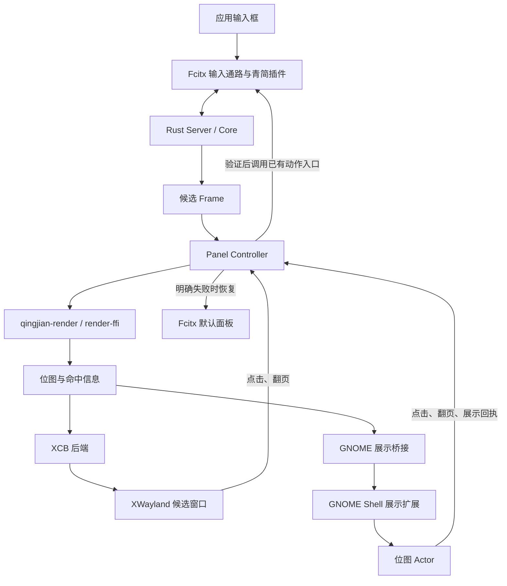

# Ubuntu / GNOME 青简自绘候选窗正式支持方案

制定日期：2026-09-17。状态：实施中，阶段 0；dbus窗口身份证明、GTK/Qt多输入框/多窗口、三档倍率及混合输出重绘已通过隔离GNOME组件实测；IBus身份、物理登录与正式连续所有权等门槛尚未通过，不代表已完成支持。实施证据与未通过项见 [阶段 0 记录](../notes/linux-gnome-stage0.md)。

本文接续 [Linux 双模式方案](linux_dual_ui_support_plan.md)，替代其中针对 GNOME 的通用 Wayland popup 主线，以及本次目标范围内的阶段划分、默认启用和验收要求。其他 compositor 的 input-method popup 研究仍保留为独立工作，不作为本次交付的前置依赖。当前事实以 [支持矩阵](../notes/linux-ui-support.md) 和 [Wayland 核验记录](../notes/linux-wayland-api.md) 为准。

## 1. 交付目标与边界

> 在指定 Ubuntu/GNOME 版本下，微信、Chrome、Firefox、VS Code、GTK/Qt 应用及终端的普通输入框，默认使用青简自绘候选 UI；覆盖原生 Wayland 和 XWayland，验证光标跟随、缩放、点击选词与失焦隐藏。异常时才回退，并记录明确原因。

“支持”必须同时满足输入正确、样式一致、定位正确和交互可靠。目标应用在正常输入时长期显示默认 Fcitx 面板，计为未通过；有回退日志不能替代自绘支持验收。

尺寸一致性纳入本次必交付：修复已使用自绘的场景中候选窗明显偏小的问题，使原生 Wayland 与 XWayland 在同一屏幕、相同配置下具有一致的逻辑大小；支持混合缩放跨屏、系统文字缩放和用户调整 UI 大小。不能只完成 Wayland 显示就将本次目标标为完成。

### 1.1 首版基线

| 项目 | 基线与要求 |
| --- | --- |
| 系统 | Ubuntu 26.04 LTS，GNOME Shell 50.1，Fcitx 5.1.19；实施阶段 0 记录实际包版本及 Ubuntu 补丁版本 |
| 桌面会话 | GNOME Wayland；同一会话覆盖原生 Wayland 应用与 XWayland 应用 |
| 原生 Wayland 展示 | 青简配套 GNOME Shell 扩展展示共享渲染器位图；该通路不创建 XCB 候选窗口 |
| XWayland 展示 | 复用现有 XCB 后端并完成正式验收 |
| 输入处理 | 继续使用 Fcitx 青简插件与 Rust Server，不替换输入法框架 |
| 样式 | 复用 `qingjian-render`、主题与排版；相同字体和参数做参考图比较，系统字体不同造成的字形差异单独记录 |
| 安装前提 | GNOME 完整版包含匹配版本的展示扩展；扩展已启用且握手成功才属于正常自绘运行条件 |

应用版本、包来源（deb / Snap / Flatpak / 官方包）、启动参数、输入法环境变量和实际输入通路必须冻结到测试记录。Chrome 与 Chromium 分别记录，不能用 Chromium 通过替代 Chrome。

覆盖两种显示路径，不要求每个应用都支持两种运行模式。例如某版本微信仅支持 XWayland，其 XWayland 场景必须通过，原生 Wayland 一栏可记录有依据的“不适用”，不得强行冒充原生运行。GTK/Qt 必须同时有小型测试程序和实际应用，不能只测试框架样例。

### 1.2 范围控制

- 本次必交付：第 1 节所列普通输入框、两条展示路径、统一配置、诊断、安装与异常恢复。
- GNOME Activities 搜索框单独列为扩展项；未验收时不得连带声明支持。进入 Overview 时，普通应用的候选窗应隐藏。
- KDE、Sway 等桌面的原生 Wayland popup，独立排期；本次 GNOME 验收不等待其完成。
- 纯 X11 桌面保留现有代码与回归；GNOME Wayland 下 XWayland 通过不代表纯 X11 桌面正式验收通过。
- 密码/敏感/禁用输入、锁屏、登录界面不属于普通候选自绘承诺。未知输入能力继续保守处理。
- 不改 Core 的候选生成、排序、学习规则、翻译或既有按键语义；设置界面和系统菜单继续使用原生控件。

## 2. 当前证据、阻塞点与解除标准

| 项目 | 当前证据 | 解除标准 |
| --- | --- | --- |
| GNOME 展示链路 | 显式构建的阶段0扩展已承载真实共享位图；正常构建仍无生产GNOME后端 | 阶段 0 在真实应用完成位图、真实候选、定位、点击、失焦与回退闭环 |
| 通用 popup 路线 | 本机普通连接未发现 input-panel v1 / input-method v2；本地 Fcitx 补丁仅接受符合条件的 `wayland_v2`，不覆盖 IBus/GNOME | 本次改用 Shell 展示；不把该补丁上游合入或安装作为 GNOME 前置 |
| 坐标与焦点对应 | dbus输入模块已有同源按键+窗口对象+IC代次实验凭证，GTK/Qt多窗/多框及跨屏通过隔离测试；IBus消息不带时间戳，尚无对应凭证 | 形成分通路坐标记录，在移动、缩放、切换焦点时正确定位且无旧帧误选 |
| 自绘尺寸偏小 | UI/文字/raster独立链路已落地；Shell采用目标monitor倍率，GTK客户端2×与输出1.5×分开；XCB倍率来源与原截图时状态仍未厘清 | 查明有效缩放和单位换算，修复缺失/重复缩放，通过第 6.4、9.4 节的尺寸与混合缩放验收 |
| 面板接管接口 | 公开callback已用于X11与有期限的Shell实验；默认Kimpanel恢复已验证，原装包恢复光标缺陷有独立上游补丁；正式连续所有权未实现 | 扩展到异步展示，验证默认面板与自绘面板互斥、断线后恢复 |
| XWayland 性能 | 旧48场景p95最高580.506ms；连续更新消除每帧unmap/map后release单场景p95约1.411ms，仍非受控完整矩阵 | 定位等待来源、完成修复和受控复测，满足第 9 节性能门槛 |
| 默认启用 | 配置默认 `fcitx`；`auto` 没有已放行路径 | 目标矩阵通过、运行时检查齐全后，再按第 10 节调整新安装默认值 |

Fcitx 的公开候选回调可以覆盖客户端候选面板选择，但不提供 GNOME 窗口定位；屏幕键盘另有更高展示优先级。必须复用框架调度，不能仅取消一个能力标记就声称接管完成。[公开接口](https://github.com/fcitx/fcitx5/blob/5.1.19/src/lib/fcitx/inputpanel.h)、[调度实现](https://github.com/fcitx/fcitx5/blob/5.1.19/src/lib/fcitx/userinterfacemanager.cpp)。

GNOME Shell 内获取窗口信息并处理相对坐标已有 Kimpanel 实现可供参考，但现成扩展使用文字控件，不会直接显示青简位图。[Fcitx 官方说明](https://fcitx-im.org/wiki/Using_Fcitx_5_on_Wayland/en#Popup_candidate_window)、[Kimpanel 定位实现](https://github.com/wengxt/gnome-shell-extension-kimpanel/blob/master/panel.js)。

目前允许启动原型开发；阶段 0 未通过前，不宣称架构风险已解除，不承诺全部应用的交付日期。失败时记录具体缺失的接口或应用通路，调整设计后再过同一门槛。

## 3. 目标架构与责任



| 组件 | 责任 |
| --- | --- |
| Server / Core | 现有输入、候选与提交逻辑；不依赖 GNOME，不接收桌面窗口对象 |
| `render-ffi` | 复用现有位图、候选命中、翻页命中和完整义项范围；不增加 Shell 布局算法 |
| Controller | 当前上下文、显示所有权、帧有效性、默认面板互斥、动作验证与回退 |
| GNOME 桥接 | 协议握手、位图传送、异步事件、超时与连接重建；每个 Fcitx 实例共享连接 |
| Shell 扩展 | 显示位图、窗口与光标锚点转换、屏幕边界、鼠标事件和自身资源清理 |
| XCB 后端 | 现有独立窗口与提交路径；完成性能、定位和生命周期补齐 |

Shell 扩展不生成候选、不解析拼音、不排版候选文字、不直接向应用提交文本。首版只为当前活动输入上下文显示一张面板，不给每个上下文创建独立的长期可见 Actor。

## 4. 后端选择与接口调整

### 4.1 按实际输入通路选择

1. `renderer=fcitx` 时使用默认面板。
2. 检查焦点、当前输入法、隐私能力和候选是否需要显示。
3. 真实 `x11:<display>` 上下文优先探测现有 XCB 路径，连接上下文报告的 display。
4. GNOME 原生上下文使用 Shell 握手能力、frontend、坐标语义、焦点对应关系判断是否可接管。IBus 上下文不能因没有 `wayland:` 前缀而直接拒绝，也不能因桌面变量写着 GNOME 就直接接管。
5. `auto` 只放行该版本声明支持且运行时条件满足的路径；`qingjian` 可以用于开发验证，但仍保留正确回退。
6. 未支持路径给出固定原因码；本次不偷偷借用 XWayland 窗口承载原生 Wayland 候选。

“应用版本及包来源”是发布验收维度；运行时未必能从 IBus 上下文可靠得到精确应用版本。运行时根据可验证的 frontend、能力、扩展协议和焦点状态选择，不能伪造一份声称能识别所有应用版本的白名单。

### 4.2 将同步窗口接口扩展为异步展示接口

当前 [Backend](../../apps/linux/fcitx5/src/panel/backend/base.h) 假设坐标均为物理像素、`present()` 同步返回结果、由 Controller 监听后端 fd。这些约束不能直接套到 Shell 的异步通信上。

- 提交结果区分 `pending / accepted / failed`；接受请求不等于画面已经绘制。
- 后端通过事件报告 `prepared / painted / hidden / released / lost`，携带第 5 节身份。Controller 在 Fcitx 主线程处理事件。
- 桥接对象负责把通信接入 Fcitx 的现有事件循环；不要求所有后端必须有独立可读 fd，不重复读取框架已经管理的 D-Bus 连接。
- XCB 实现保留同一公共生命周期接口；不要借此把 GNOME 坐标换算塞进 XCB 代码。
- 分离候选帧更新与窗口销毁。当前每帧 `hide()`、清面板、重装回调的流程要调整为有效帧之间更新，避免异步路径每按一次键就闪烁或反复切回默认面板。
- 异步回调用上下文弱引用及代次验证，不能捕获可能已析构的 `InputContext *`、Session 或渲染结果裸指针。
- `QingjianEngine::render()` 区分“自绘等待回执”和“已回退”，不能在 pending 时执行现有 `if (!custom)` 的默认曝光回报。

## 5. GNOME 桥接协议与位图通路

以下为拟定协议，阶段 0 验证后冻结 v1；不是仓库已有接口。命名、目录和限制在实现时同步到设计文档。

### 5.1 传输与显示

首选用户会话 D-Bus 传控制消息和 Unix FD，每帧通过密封的 memfd 传预乘 RGBA8。建议扩展提供 `org.qingjian.Panel1`，只服务已握手的 Fcitx 插件连接；不占用现成 Kimpanel 的服务名。

- 阶段 0 必须实测 Fcitx D-Bus 绑定的 FD 发送、GJS 的 FD 接收及 GIO 异步读取，不能把“底层 D-Bus 支持 FD”当作全链路已经可用。
- 扩展将有界字节数据交给 `St.ImageContent` 并挂到非键盘聚焦的 Actor。GNOME 50.1 源码已有 `set_bytes()`，但本机 GJS 可调用性、像素格式、Cogl context 获取和延迟仍需验证。[50.1 接口](https://github.com/GNOME/gnome-shell/blob/50.1/src/st/st-image-content.h)。
- 首版允许异步读取后的有界内存复制，不以零拷贝为前提。不得逐帧写临时 PNG、base64 编码，或在 Shell 主线程同步读文件、等待 socket、扫描字体。
- 如果 FD 方案不能在目标绑定落地，阶段 0 比较用户运行目录内的 Unix socket + 有界原始字节流；明确复制成本和事件循环接法后再选定一种生产通路，不同时维护两个未经验证的方案。
- 位图之外只传身份、尺寸、几何、主题代次及交互元数据；扩展不需要候选明文列表来重新排版。位图本身仍包含用户输入，禁止落盘或写入普通日志。

### 5.2 身份、几何和消息

复用现有 `FrameIdentity = generation + context UUID + revision`，展示层另加：`transport_epoch`（扩展重连代次）、`focus_epoch`（焦点租约）、`submission`（同一 Frame 的重绘序号）、`geometry_revision`（坐标/缩放版本）。这些字段不改变 Core 协议语义。

| 消息 | 主要内容和含义 |
| --- | --- |
| `Hello / Capabilities` | 协议版本、Shell 版本、支持的像素格式、尺寸上限、缩放与交互能力、连接代次 |
| `BindContext / Geometry` | 身份、frontend、坐标空间、光标矩形、客户端 scale；扩展返回焦点租约、显示区域、目标栅格倍率及其来源、文字缩放和几何版本 |
| `PrepareFrame / Prepared` | 身份、像素 FD、width/height/stride/length、逻辑尺寸；只完成读取和纹理准备，暂不显示 |
| `Show / Painted` | 同一 submission 激活显示；`Painted` 表示该 Actor 已参与绘制，不能把普通 D-Bus 应答当作此回执 |
| `Pointer / Scroll` | 展示身份、面板局部坐标及按钮/滚动方向；插件在原渲染结果上做命中和动作验证 |
| `Hide / Hidden` | 作废相应显示租约、撤下 Actor、停止交互；重复 Hide 幂等 |
| `Release` | 扩展不再读取对应像素存储；与是否可见、是否学习曝光是不同事件 |
| `Lost / Error` | 对端退出、协议错误、能力丢失或超时，附固定原因码 |

GJS 中的 64 位序号必须采用可无损往返的表示，不转换成可能丢精度的普通 JavaScript Number。跨代次、旧几何、旧焦点、旧 Frame 的消息均丢弃；`Hide` 留下作废标记，晚到的 `PrepareFrame` 不能复活已隐藏候选。

### 5.3 缓冲与背压

- 首版协商上限沿用当前最大 1600×900 像素，单帧像素不超过 5,760,000 字节；逐项检查宽高、stride、length 与整数溢出。上限不足时应按可用空间重新布局，不能缩小截图后假称视觉通过。
- 发布 FD 前完成内容写入和必要密封；同一存储提交后不覆写。检查 FD 长度与声明一致，读取完成不代表已显示。
- 最多保留当前显示帧、一个正在提交帧、一个待处理最新帧。积压时合并尚未显示的候选更新，优先处理 Hide/失焦/断线，不排队重放过时候选。
- 插件保留当前可点击 submission 的渲染结果；新帧显示回执到达后切换命中对象并释放旧结果。按键更新后旧 revision 的点击立即作废。
- 断线时两端分别释放 FD、字节对象、纹理、渲染结果和事件订阅；Shell 重连创建新代次，不复用旧帧。
- 通信绑定 D-Bus 实际唯一名称和当前会话，拒绝未握手来源；可选 socket 仅放当前用户运行目录并检查连接凭据，不提供任意路径文件读取功能。

## 6. 定位、缩放与交互

### 6.1 坐标必须有明确类型

至少区分：X11 根窗口物理坐标、客户端相对坐标、Shell stage 坐标、位图像素坐标。输入锚点携带坐标类型及其 scale，不能统一乘一次 `scaleFactor()`。

- XCB 路径保留当前物理坐标约定，按其独立测试结果处理 XWayland 缩放。
- Shell 路径按 frontend 和 `RelativeRect` 等能力解释光标矩形，使用目标 GNOME 的窗口坐标转换接口。不能把相对坐标直接当桌面绝对坐标。
- Shell 掌握窗口位置、输出、工作区和可用区域；插件据扩展返回的目标像素密度及可用逻辑尺寸渲染。切屏或缩放变更增加 `geometry_revision`，要求新尺寸重绘。
- 从 Shell stage 到候选局部坐标、再到位图像素的转换只做一次，并沿用同一 submission 的比例。阴影、空槽和页码用共享渲染器已有命中结果处理。
- 候选主体优先放光标下方，底部不足时翻到上方，按当前屏幕可用区域裁限；不通过裁切候选文字掩盖布局超限。

### 6.2 焦点对应是阶段 0 的必验项

不能只拿一份晚到的光标坐标，加上“此刻 Shell 的焦点窗口”就显示。阶段 0 记录每类 frontend 的 FocusIn/FocusOut、cursor 更新与 Shell 焦点事件顺序，建立有代次的绑定。

Shell 焦点窗口变化时立即隐藏并作废租约；插件重新确认当前上下文和有效锚点后申请新租约。同窗口不同输入框切换同样更新上下文身份。没有可靠对应或有效锚点时回退并记录原因；目标应用因此持续回退则验收失败，继续修通路。

监听窗口移动/缩放、工作区切换、窗口销毁、显示器变化、Overview 和会话锁定。不能只在按键产生新 Frame 时更新位置，否则用户拖动窗口时仍会漂移。

### 6.3 不抢焦点与动作回传

扩展不调用窗口激活、键盘聚焦或模态 grab。仅候选交互区域接收指针事件；点击候选后原应用仍拥有键盘焦点。

插件验证当前输入法、会话、revision、focus epoch 和 submission 后，通过已有选词/翻页入口执行动作。连续点击、滚轮积压及点击时恰逢换页均最多提交一次；不由扩展合成字符或注入全局键盘事件。

### 6.4 自绘尺寸偏小：缩放解析与字号校准

2026-09-17 本次排查记录：主屏缩放约为 166.67%，副屏为 100%，X11 的 `Xft.dpi=192`，GNOME 文字缩放为 1.0。此记录描述当前环境，不能从 `192 / 96` 推定两个屏幕都应放大两倍，也不能仅凭截图认定应用上报了 1 倍。

初始基线代码事实（本轮已拆开UI/文字倍率，Shell实验使用monitor raster；XCB来源仍未验证）：共享主题的候选/译文/序号基础字号为 `16 / 12 / 11`；[Linux 渲染入口](../../apps/linux/render-ffi/src/lib.rs) 使用该主题，[Controller](../../apps/linux/fcitx5/src/panel/controller.cpp) 直接把 `InputContext::scaleFactor()` 作为栅格倍率。当前没有对显示器缩放与 XWayland 合成结果做独立核验，也没有继承 Fcitx Classic UI 的字体配置。[主题定义](../../crates/qingjian-render/src/theme/mod.rs)。

先对复现场景采集 frontend、上下文 scale、光标所在输出、输出 scale、Xft DPI、系统文字缩放、最终位图尺寸和窗口显示尺寸，分清基础字号偏好与有效缩放错误。截图时的实际上下文 scale 尚未记录，不能把推测写成已确认根因。此项适用于现有 X11/XWayland 自绘，可先于 GNOME 扩展完成独立诊断和修复。

将尺寸参数拆开，并由 Linux 展示层统一解析：

| 参数 | 含义与处理 |
| --- | --- |
| 基础主题尺寸 | 共享主题的逻辑 UI 单位，保持候选/译文/序号的层级；不能把主题注释里的“点”直接当作 Pango 排印 pt 后统一乘 `96/72` |
| 栅格倍率 `r` | 当前后端从逻辑尺寸到位图像素的映射；有明确来源和可信度，不盲信客户端 scale，也不把客户端、屏幕和 Xft 倍率相乘 |
| 系统文字倍率 `t` | 跟随 GNOME 文字大小偏好；若选用的 DPI 已包含文字放大，先分解或消除重复影响；无法可靠分解时明确记录并验证另一来源 |
| 用户 UI 倍率 `u` | 青简独立大小偏好，默认 1.0；统一调整字体、间距、圆角、阴影和交互区域，不修改输入坐标 |

渲染前，字体及其行高按 `基础值 × u × t` 生成逻辑主题，间距等按 `基础值 × u` 生成，再由渲染器以 `r` 栅格化。文字增大后重新排版，不能保持旧行高裁切字形。设备倍率与大小偏好分别保留，不能把所有参数塞进一个 `scale` 后又在 Actor 或窗口层重复缩放。

- Shell 路径由扩展确认目标输出和栅格倍率；位图按像素提交，Actor 按协议中的逻辑尺寸显示。不得把高分辨率位图的像素宽高直接当逻辑宽高，也不得再重复乘/除输出倍率。
- XCB 路径必须验证 X11 窗口像素到最终桌面显示的关系，包括 XWayland 是否继续缩放。`Xft.dpi` 和上下文 scale 均只在语义明确时采用；不把主屏的倍率固定应用到副屏。无法取得正确尺寸时记录 `scale_unresolved`，目标场景持续因此回退仍计为未通过。
- 跨屏、系统文字大小或 UI 大小变化时，增加几何/展示代次，重建必要的布局与字形缓存、位图和命中区域；重新读取像素不能代替重新渲染。
- UI 大小不乘到光标的桌面位置上；鼠标局部坐标按当前 submission 的变换映射到新位图，旧比例与旧点击立即失效。
- 先在 100% 屏幕、系统文字倍率 1.0、用户 UI 倍率 1.0 下冻结尺寸参考，记录 Fcitx 常规配置下的主候选字体作可读性对照。Fcitx 不同主题的边距、译文字号和窗口宽高可以不同，不要求两个面板逐像素等大。
- 保持共享主题默认值及 Windows/macOS 输出稳定；Linux 校准通过该平台的尺寸解析和主题副本完成，不为单台设备直接放大全平台字号。

## 7. 展示所有权、异常恢复与曝光

### 7.1 接管时序

插件和扩展启动后提前握手、预热渲染器；焦点到达时尽早确认几何。已就绪的正常路径应从首个候选开始自绘，不能把每次输入先闪现 Fcitx 再切换当作正常实现。

首次接管采用准备与显示两阶段：

1. 接管条件满足时进入有期限的自绘准备，尚未显示的首帧不立即改走默认面板；条件缺失或准备超时才记录原因并使用默认面板。后台完成握手、几何确认与隐藏纹理准备；已经处于故障回退状态的默认面板保持可用。
2. `Prepared` 到达后重新校验身份，清除旧默认候选并 flush，安装自定义回调，再发送有截止时间的 `Show`。
3. `Painted` 到达后标记该 submission 可见。正常连续输入沿用自绘所有权更新位图，不在每帧默认面板与自绘间来回切换。
4. 任一阶段失焦、换输入法或出现新 revision，取消过时显示请求并优先处理撤窗。

`Preparing / AwaitingPaint / Visible / Hiding / Fallback` 必须有明确状态和超时。现有 XCB 的同步成功可映射到已接受提交，但其“屏幕已可见”证据仍须独立测量。

### 7.2 回退时序

先作废点击与显示租约，撤下自绘，再解除自定义回调，最后刷新当前仍有效的默认候选；不重发按键或 Commit，不重复上屏。

扩展自行监视插件退出、失去 D-Bus 名称、focus epoch 变化和显示租约超时，及时隐藏。插件监视扩展退出、展示超时和异常回执。单靠插件发一次 Hide，无法覆盖插件崩溃或消息丢失。

初始建议展示确认期限 250 ms、显示租约 500 ms、活动时每 100 ms 续约；这些是阶段 0 待验证参数，不是当前保证。每次显示/绘制前检查租约，拒绝过期 Show。无法确认 Hidden 时，回退必须考虑租约到期，避免刚恢复默认面板又显示晚到自绘。需要延长参数时记录原因并重新验证体验，不允许无限等待。Shell 主循环整体冻结不属于能够保证按时恢复的条件。

扩展停用、版本不匹配、服务重启、后台字体未就绪等原因分别记录。恢复后在新的有效 Frame 上重新探测并接管，避免每个按键都进行失败握手或刷日志。

### 7.3 展示回执与学习

- 保持现有 `DisplayAcknowledged` 索引及 Server 验证，不在桥接层引入学习逻辑。
- `Prepared`、FD 已写完或请求已接受不能触发青简曝光回报；收到当前帧 `Painted` 后才按渲染结果回报完整义项。
- `Painted` 是软件绘制里程碑，不保证显示器已扫描输出；物理可见延迟按第 9 节另测。
- 异步回执若落后于已提交/换帧的 revision，应丢弃并保守少记，不阻塞按键等回执，不把旧曝光归到新候选。
- 默认回退继续遵循已有默认 UI 的保守回报语义。同一 Frame 因重绘或回退改变可见范围时更新集合，不重复增加学习次数。
- Password/Sensitive/Disable 或隐私能力动态变化时，撤窗并清理待发位图和缓存，不向扩展继续传候选。

## 8. 代码改动地图

新增路径为建议布局，实施时仍遵守一个类型一个文件、按职责分目录的仓库约定。

| 路径 | 计划工作 |
| --- | --- |
| `apps/linux/fcitx5/src/panel/backend/` | 改造异步展示接口、能力探针与选择器；保留 XCB 实现及错误细分 |
| `apps/linux/fcitx5/src/panel/gnome/`（新增） | 共享桥接连接、协议编解码、上下文绑定、位图传输和事件适配 |
| `apps/linux/fcitx5/src/panel/` | Controller 状态、展示租约、geometry/submission 身份与生命周期；新增集中管理的尺寸解析，区分栅格、文字和用户 UI 倍率 |
| `apps/linux/fcitx5/src/qingjian.cpp` | 调整每帧重建、默认面板交接、pending 与曝光处理；不改候选顺序或提交语义 |
| `apps/linux/gnome-extension/`（新增） | GNOME 50 扩展入口、协议、位图 Actor、几何、输入、会话状态与资源清理；分别成文件 |
| `apps/linux/probes/gnome/`（新增） | 阶段 0 固定帧发送器、位图通路检查和真实上下文诊断；不随普通生产路径自动运行 |
| `apps/linux/fcitx5/tests/`、`apps/linux/gnome-extension/tests/`（新增后者） | 状态、失效、传输与几何测试；扩展实际绘制另用桌面测试 |
| `apps/linux/fcitx5/tests/desktop/` | 在保留现有隔离 X11 夹具基础上，增加真实 GNOME 场景记录与复现工具 |
| `apps/linux/render-ffi/` | 接收 Linux 展示参数并调整主题副本；需要新增入口时保留 ABI 版本检查及旧入口兼容，不改变共享主题默认值 |
| `apps/linux/server/src/dispatch/` | 透传 Linux UI 大小配置，协商可用字段；不处理桌面 DPI，不改变 Core 候选逻辑 |
| `crates/qingjian-platform/src/config/linux_ui/` | 新增 UI 大小及跟随系统文字缩放配置；完成验收后调整默认策略，保留显式用户选择 |
| `apps/linux/scripts/`、`apps/linux/packaging/debian/` | 扩展组件、依赖、版本匹配、安装检查、升级/卸载与诊断工具 |
| `docs/design/`、`docs/notes/`、`docs/user/` | 冻结协议设计、真实支持矩阵、性能原始记录和用户安装/回退说明 |

Core 和 Windows/macOS 协议无需因本次尺寸修复而变更。Server 仅在 Linux 显示配置中透传新增字段，进行版本/能力协商并验证旧插件/旧 Server；不顺带改共用候选协议。

## 9. 验收矩阵与性能

### 9.1 应用覆盖表

阶段 0 建立实际版本表，以下每个适用单元最终都要有证据。所有行当前均为“待验收”；微信已有用户观察，仍需按统一规则补记录。

| 应用 | 原生 Wayland | XWayland | 普通输入场景 |
| --- | --- | --- | --- |
| 微信 | 该版本支持时测；否则有据记录不适用 | 必测 | 聊天输入框、搜索框 |
| Google Chrome | 必测，确认实际 Ozone/窗口后端 | 必测 | 地址栏、HTML input、textarea、contenteditable |
| Firefox | 必测，确认窗口协议 | 必测 | 地址栏及同一组网页输入框 |
| VS Code | 必测，记录 Electron 与安装来源 | 必测 | 编辑器、搜索、集成终端 |
| GTK4 测试 Entry + GNOME Text Editor | 必测，区分 text-input 与 Fcitx 模块通路 | 必测 | 单行与多行文本 |
| Qt6 测试输入框 + 阶段 0 选定实际 Qt 应用 | 必测，记录平台插件与输入模块 | 必测 | 单行与多行文本 |
| Ptyxis 或阶段 0 冻结的终端 | 必测 | 应用提供 X11 后端时必测 | 普通 shell、命令行编辑器 |

启动参数只用于明确运行模式和输入法配置，不用强制 X11 来替代原生 Wayland 验收。应用显示“Wayland 会话”不足以证明原生运行；记录实际窗口协议、Fcitx frontend、显示后端选择与桥接握手。原生路径还应确认青简候选没有建立 XCB 连接，不能仅以清空 `DISPLAY` 作为证明。

### 9.2 每行的必测动作

- 输入、空格/数字选词、鼠标选词、翻页、滚轮，恰好上屏一次；拼音行三种位置配置保持既有行为。
- 候选显示期间移动和调整窗口大小；同应用切输入框、跨应用快速切换、切工作区、最小化和关闭窗口。
- 100%/125%/150%/约 167%/200% 缩放；必测当前约 167% + 100% 的双屏组合；屏幕四边、负坐标布局、全屏和热插拔。
- 浅/深色、横/竖排、长 CJK、日文读音、emoji、生词标记、空槽和多义项；相同参数对照共享渲染器参考图。
- 扩展停用、插件/Server 断开、Fcitx 重启、扩展重新加载或重新登录；旧帧、重复回执、失效点击均被拒绝。
- 自绘与默认面板不同时显示；默认面板恢复后仍能键盘和鼠标选词；异常恢复后可再次进入自绘。
- 屏幕键盘出现时遵守 Fcitx 优先级并隐藏冲突自绘，不把该情况计作普通硬件键盘路径通过。

定位建议验收误差：在固定测试控件中，约定锚点偏移之外的误差不超过 2 个逻辑像素；翻转/屏幕边界裁限按明确规则检查。不得只凭“看起来差不多”标为通过。

多屏硬件或目标应用缺失时可以继续其他开发，该单元保留未验收，不能用模拟坐标测试替代真实桌面结论。

### 9.3 性能口径

保留旧方案对 UI 新增处理工作的预热目标：p95 ≤ 5 ms、p99 ≤ 10 ms。分别记录布局、栅格、传输准备、Shell 读取/纹理上传、XCB 提交的耗时；异步阶段按 Frame 身份关联，不能相加重叠区间伪造总耗时。

新增可见延迟目标：在记录硬件、刷新率且刷新率不低于 60 Hz 的受控桌面，`Frame ready → painted` 预热 p95 ≤ 50 ms、p99 ≤ 100 ms。该目标独立于 5/10 ms 的处理工作目标；报告中区分软件回执、合成器呈现与物理屏幕可见，不把三者混为一个指标。

- 每个性能场景至少 100 次预热、1000 次采样，包含短/长文本、纯高亮变化、换页与上述五档显示缩放；另覆盖 UI 大小及系统文字放大后的代表场景，进程冷启动、首次字形和扩展首次显示另测。
- `Key → Frame ready` 单独测，以辨别 Server IPC 与 UI 的延迟；桥接不能在 Fcitx 按键线程或 Shell 主线程阻塞等待对端。
- 记录帧合并/丢弃、回退次数、队列长度、FD 数、内存和 Shell 主线程耗时。仅丢弃尚未显示的旧候选更新，不得丢提交动作。
- 异常恢复建议目标：Shell 主循环正常运行时，扩展断开/失效后 750 ms 内撤下自绘并恢复可用默认面板；失焦正常隐藏应在下一次可绘制帧完成。
- XCB 的既有长尾结果必须保留，调查同步 checked request 等待并复测。不可删除错误检测、仅统计请求入队时间，就宣布提交性能达标。
- 截图/录像使用固定样例文本；性能 CSV、环境与复现步骤随验收记录保存。上述新增阈值如需调整，必须先更新验收约定并解释，不能测完后静默放宽。

### 9.4 尺寸专项验收

| 场景 | 通过要求 |
| --- | --- |
| 已反馈偏小的自绘应用 | 重现并记录修复前后的同屏、同字体、同文本候选截图；明确采用的倍率及来源，解释尺寸差异，不能只记录“已放大” |
| 主屏约 167% 与副屏 100% | 两屏各自达到逻辑尺寸参考；候选显示时双向移动窗口后及时重绘，无漏缩放、双倍放大、持续模糊或点击偏移 |
| 原生 Wayland 与 XWayland | 同一屏幕、固定字体、主题和 UI 配置下，主候选、行高及内边距换算到逻辑坐标后与参考误差不超过 2 个逻辑像素；整数像素取整单独记录 |
| Fcitx 面板对照 | 同屏记录 Fcitx 的字体配置、有效 DPI 和参考文字尺寸；青简主候选达到预先冻结的可读性基准，保留译文/序号的视觉层级，不以整窗等宽等高作为目标 |
| 用户 UI 大小 | 100%/125%/150% 三档按比例生效，75%/200% 边界有明确行为；词条、译文、序号、间距和命中区域保持一致，不靠拉伸已有截图实现 |
| 系统文字放大 | 文字倍率 1.0/1.25 下文字和行高正确增大，无裁字、叠行和重复放大；关闭跟随后仍正常应用屏幕缩放与 UI 大小 |
| 动态变更和旧状态 | 切屏、缩放设置变更及配置重载后使用新几何代次；旧纹理和旧点击不影响新候选，空间不足仍遵循有界布局规则 |

参考图使用固定许可字体、固定文本及同一捕获坐标空间；原始截图不可经图片查看器额外缩放后量尺寸。误差按逻辑单位记录，不能以不同屏幕上肉眼相同的物理毫米数代替逻辑尺寸验收。仅通过离线渲染器的 scale 测试不能解除本项。

## 10. 配置、打包与诊断

保留三种模式：`fcitx` 强制默认面板；`auto` 在已支持且运行时可用路径选择自绘；`qingjian` 请求自绘并在失败时回退。开发期间默认仍为 `fcitx`。

以下尺寸配置已接通并通过代码级测试；真实桌面尺寸专项仍待验收：

```toml
[linux_ui]
renderer = "qingjian" # 开发验证；正式默认策略按下文执行
ui_scale_percent = 100
follow_system_text_scale = true
```

`ui_scale_percent` 支持 75–200 的整数，默认 100；它表示用户大小偏好，不能用于隐藏未修复的 DPI 错误。无效值诊断后使用默认值，界面显示实际生效值。`follow_system_text_scale` 默认开启，仅控制文字偏好，不关闭显示器缩放。UI 配置在明确的重载事件生效；首版若要求重启服务，必须在用户文档写明，不能声称热更新已实现。Fcitx Classic UI 的字体设置不自动改写青简配置。

应用矩阵、可靠性和性能通过后，在阶段 5 的候选安装包中将新安装默认值改为 `auto`，继续验证安装与升级；第 12 节全部完成后才正式发布这个默认策略。旧配置里显式写了 `fcitx` 的用户不得被覆盖；升级提供明确的切换说明。缺少扩展的最小安装可以使用默认面板，但不能标成“GNOME 自绘完整支持”。

- GNOME 扩展与插件分别有版本、共同协商协议版本；扩展 metadata 仅声明验证过的 Shell 主版本，安装前诊断实际 Shell 小版本。
- 完整安装入口包含扩展及其启用步骤，用户选择安装完整 GNOME 功能时一次完成必要流程；系统包安装脚本不在 root 环境强改用户扩展状态，不自动重启 Shell 或注销会话。
- Wayland 下的 Shell 更新/重载按目标版本支持方式处理，需要重新登录时明确提示，不承诺通用的原地 Shell 重启。
- 卸载只移除青简组件，停用自绘并清理其资源，保留用户词库和配置，恢复默认面板可用状态。
- 诊断命令或状态页展示系统/Shell/Fcitx/插件/扩展版本、实际 frontend、坐标类型、后端、最近失败原因；并显示上下文 scale、目标输出 scale、Xft DPI、文字/UI 倍率、最终栅格倍率及来源、位图与逻辑尺寸。不得只显示“已开启自绘”，也不能把一个未经解释的 scale 当作全部缩放状态。
- 原因码至少区分 `extension_missing`、`protocol_mismatch`、`unsupported_frontend`、`anchor_unavailable`、`focus_mismatch`、`scale_unresolved`、`buffer_invalid`、`paint_timeout`、`transport_lost`、`renderer_unavailable`、`xcb_failure`。外部文案用中文；记录代次及耗时，不记录候选或拼音。
- 既有每个上下文去重日志升级为后端状态变化日志；正常支持路径发生回退时可统计、可定位，不能无限刷屏。

## 11. 分阶段实施与检查

| 阶段 | 工作与产物 | 进入下一阶段的条件 | 初步工作量 |
| --- | --- | --- | --- |
| 0：解除关键前置 | 冻结环境；验证 FD → GJS → 纹理；固定帧随真实光标显示；接真实候选；完成原生浏览器、GTK 和 Qt 的通路记录，采集已有自绘偏小场景的实际倍率 | 原生 Wayland 真实候选可点击、定位正确、不抢焦点；至少 100%/150% 及本机约 167% 缩放、失焦/断线回退通过；不依赖 XCB 候选窗 | 3–5 人日 |
| 1：展示基础改造 | 异步 Backend、Controller 状态、Frame/焦点/几何身份；保留 XCB 回归 | pending、乱序、断线、重入、旧帧和曝光语义测试通过，无默认双窗 | 3–5 人日 |
| 2：GNOME 正式实现 | 扩展模块化、坐标转换、输出/工作区事件、位图背压、交互和资源回收；接入统一尺寸策略 | 阶段 0 场景使用正式代码通过，多屏/五档缩放/连续输入通过，完成与 XWayland 的尺寸对照 | 5–8 人日 |
| 3：XWayland 补齐 | 调查提交长尾，改进上传/错误处理，完成几何及焦点回归；修复已有自绘偏小，接通 UI 大小配置与诊断 | XWayland 真实应用、尺寸专项和性能通过；不影响默认面板恢复；尺寸任务可提前独立推进 | 4–7 人日 |
| 4：应用矩阵与故障 | 补齐第 9 节目标应用、包来源、模式和故障注入；保存原始证据 | 所有必测单元通过，未支持项有明确范围且不偷换目标 | 4–7 人日 |
| 5：默认策略与发布 | 完整安装包、扩展启用、诊断、升级/卸载、默认 auto 与用户文档 | 干净用户环境安装、升级、卸载和回退通过 | 2–3 人日 |

纳入已有自绘尺寸修复与配置后，合计为阶段 0 成功、测试设备与应用齐备时的 **21–35 人日初步估算**，不是交付承诺。阶段 0 结束后根据真实 GNOME 通路与缩放根因重估；若定位或位图 API 不成立，停下依赖该结论的后续工作并形成失败记录，不能靠扩大回退范围宣称完成。

检查分层执行：

1. 代码级：协议长度/FD/64 位身份、状态机、背压、隐藏优先、几何转换、缩放来源缺失/重复的解析、字号与 UI 配置、失效点击和学习回执的有意义测试。
2. 组件级：假扩展/假插件断线和乱序、真实 memfd/D-Bus、现有 Xvfb/XCB、render-ffi 边界与像素/命中测试。
3. 桌面级：隔离或专用用户的 GNOME 会话测试；嵌套 compositor 可辅助调试，但正式结论需本机真实窗口。不要把插件成功加载当成输入通路已跑通。
4. 发布前：按 `docs/contributing.md` 执行适用的 Rust fmt/clippy/test、CMake/CTest 和打包检查。纯 JS 语法检查不能替代 GJS/GNOME 运行验证。

阶段 0 允许临时原型，但必须记录执行命令、代码提交、GNOME 版本、测试应用、输入法通路、实际自绘后端与截图；原型检查项未通过就保持阻塞状态，不只提交一个“能编译”的实现。

## 12. 完成定义与交付物

- [ ] 原生 Wayland 应用使用 Shell 展示青简位图，XWayland 应用使用已验收后端；有实际路径证据。
- [ ] 微信、Chrome、Firefox、VS Code、GTK/Qt 实际应用及终端的适用必测项全部通过；正常输入时默认自绘。
- [ ] 光标跟随、分数缩放、多屏、点击、翻页、失焦和快速切换通过；无双窗、误选、重复上屏或残留。
- [ ] 已反馈的自绘尺寸偏小问题有明确根因及修复证据；约 167% + 100% 双屏、两种显示路径的尺寸一致性、系统文字缩放和用户 UI 大小配置通过第 9.4 节验收。
- [ ] 扩展/插件/Server 异常恢复可用；恢复后可再次自绘；原因码可诊断。
- [ ] 共享渲染器视觉与命中一致，隐私和曝光不回归，性能工作量与可见延迟分别达标。
- [ ] 完整 GNOME 包、扩展启用、默认策略、升级/卸载和干净用户安装通过。
- [ ] 协议设计、真实应用支持矩阵、性能原始数据、用户操作说明已同步。

交付物包括正式代码与安装包、冻结的桥接协议文档、每个必测单元的结果表、固定文本截图/录像、性能 CSV、故障复现步骤及当前已知限制。正常场景长期回退、未测试、只有编译通过、只有色块或只有键盘可用，都不能勾选对应的正式支持项。
